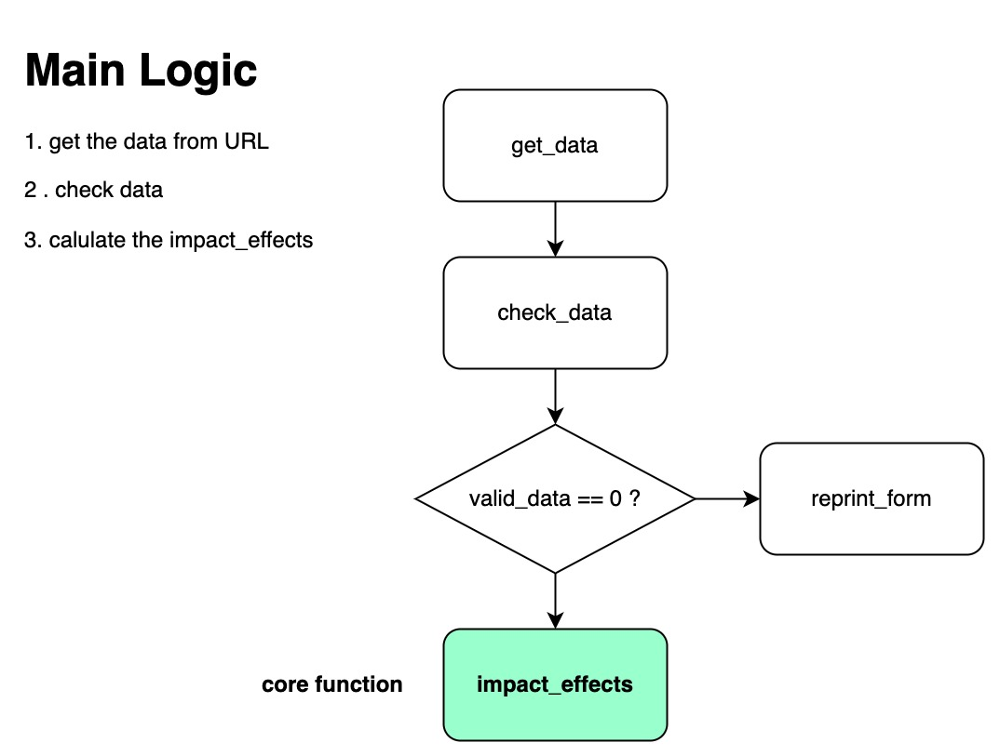
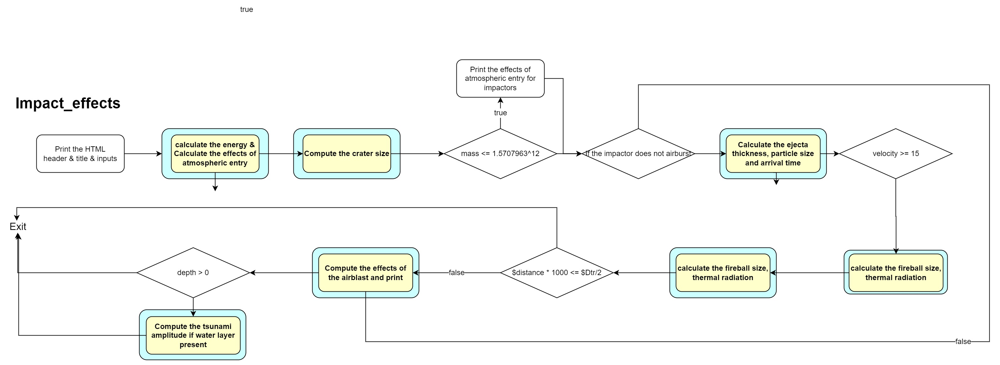
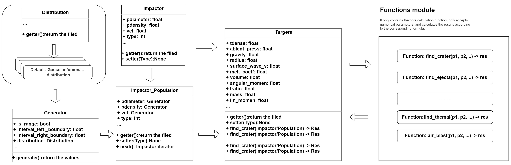

# Proposal for Impact Effects

## Introduction

Our main goal is to rebuild a Python library based on the original code and thesis. It can provide necessary functions and expansion to build their own applications to simulate and observe the whole process of asteroids and comet impacts. Users can use it for experimental teaching, but also use the results it produced for scientific research. Some possible application directions, for example, use the results it produces to build a risk prediction tool, predict the possible impact of impact events, and so on. We will consider the necessary expansion, including the result of a web program to visualize the impact event, and use the Python library we built as the core. In addition, we plan to support the impact of the asteroid and the comet population on the target planet, because this situation is quite common.

## Background: Structure of original program

First, let's analyze the main logic of the original web program. After sorting out, we can extract key functions from it as the basis of implementing Python Library.



Web programs obtain data from the user input and check the effectiveness of the data. The IMPACT-EFFECT function affects the effect to calculate all the states and results, which contains a large number of sub-functions. The detailed logic of Impact-Effect is as follows:

**The main logic of impact_effects is:**



As shown in the figure, the yellow part is the key function, and many important results are calculated using the formulas in the text. And if the box is wrapped in blue, that means that the function will print the relevant results.

Impact_effects overall logic is relatively simple, and gradually calculates related physical parameters.If the impact process meets some conditions, some additional calculation processes will be triggered.

### Drawbacks

In fact, the original code worked so well that the simulator quickly produced the results and displayed them on a web page. However, it still has some problems with our goals. 
- First, it is based on the scripting language Perl. Perl is a great language, but we wanted to build a tool that would be widely used. According to the most recent TIOBE data (May 2022), Perl ranks 17th in usage at less than one percent. Python ranks first at 12.74\%. This means that if we rebuild a library using Python, more users can save on the cost of learning the language. The audience will be much wider.
-  Second, the code structure can meet the requirements of building web applications, but it is strongly coupled. Strong coupling means that the main functions and variables in the program are bound together, which can cause a lot of trouble for subsequent extensions. A change in one variable may involve changes in several functions. Worse, however, are the references between variables and functions that are not shown. This is very unreadable code. 
- Third, the original code did not support modularity, nor did it support modern programming methods such as version control and continuous integration. This means that code quality cannot be guaranteed through continuous integration or benefit from modern automated deployment and testing tools. The lack of support for version control makes it difficult to work in groups during code development and to roll back code.

## ImpactEffect(Python Library) Design

### Objective

As some of the above problems exist, we consider using Python and modern programming techniques to build a usable and extensible Library while retaining the main functions of the original code. 
- We first want to use object-oriented programming ideas to organize our functions and data. The advantage of the object-oriented paradigm is that functions and data are bound together to simulate the real world in the form of an entity, such as an impactor, which we abstract as a class. The impactor class contains parameters that describe its properties, as well as necessary functions and methods. Similar logic applies to the target planet. So we can abstract the impact process, decouple it from the impactor and the impacted planet. 
- Second, we wanted to integrate version control and CI/CD so that we could continue to advance and evolve our projects. CI/CD supports automated validation and deployment of our code, reducing the probability of significant bugs. 
- In the end, we want the new Library to be easy to extend and easy to use, much of which depends on our code design.

### Design Details



Based on object -oriented ideas, we redesigned the entire program.The picture above shows the overall structure of IMPACTEFFECT.As shown in the figure, it is roughly divided into three modules:

#### Function modules
The function module follows functional design, which contains all core calculation functions.Each function only accepts valuable parameters and returns the results of numericalization.When implementing, try to ensure the atomicization of the function, that is, there is no mutual dependence between functions.This atomic design makes the coupling of this part very low, which is conducive to subsequent expansion of new computing functions.

```python
def find_crater(p1, p2, p3):
    # ...
    return r1, r2, r3

def find_ejecta(p1, p2, p3):
    # ...
    return r1, r2, r3

###### etc...

```

#### Impactor/ Impactor_Population/ Generator

We look forward to designing a reasonable structure in this part, which can describe both a single impact device and can describe a impact distribution.Therefore, we need to design multiple classes to describe such a complex situation.

**单一撞击器**
We often consider this situation, that is, a single impactner hitting the target planet.Under such conditions, we only need to consider how to describe a single impact device.This is relatively simple, because a single parameter is not variable, so it can be represented by a value.
```python
class Impactor(Object):

    def __init__(p1, p2 ,...):
        self.p1 = p1
        self.p2 = p2
    
    def __getter__():
        return value
```

**Population of Impactor**
The situation is much more complicated for Population of IMPActor.For Population of Impactor, the description of its parameters may be composed of multiple distributions.It is not a single hitter, but consists of many impactters.Therefore, when we calculate the consequences of impact, it is unrealistic to use the distribution of parameters to calculate.Therefore, we need to use the sampling technology to select a series of specific impactters and use them to calculate the corresponding impact results.Impactor_population is used to describe their class.

```python
class Impactor_population(Object):
    def __init__():
        return

```

In order to achieve sampling, we first consider building a generator class. The Generator class represents all the values of a parameter. It can represent a distribution or a specific value.Generator provides a basic generate function to return all values.In general, the parameter of the IMPACTOR_POPULATION will be defined as such a type, and the IMPACT_POPULATION will also provide iterators to generate specific impacts.

```python
class Generator(Object):

```

In addition, the parameters of the impact may obey different distributions, so we need a class to describe different distributions.A common design idea is that the IMPACT_EFFECT package provides an abstract parent class that needs to inherit this parent class.Library provides common distribution implementation by default, such as joint distribution and normal distribution.If users want to use a custom distribution, they need to inherit the Distribution class and implement relevant functions.

```python
class Distribution(Object):
    def __init__():
        return

class UnionDistribution(Distribution):
    def __init__():
        return
```

#### Targets Class

Targets contains main functions and user interfaces.The parameters of the constructor are related parameters of the target planet transmitted by the user.Targets contains a series of important functional interfaces, such as Find_cr ().The user calls the interface and the instance of the Impactor/Impactor_Population. The interface is determined to pass the parameter type and perform different logic.If the passing parameter is impactor_population, then a MAP type is returned.The MAP key is the specific impactor, and the corresponding key value is the calculation result.The core calculation logic of the interface depends on Function Module.

```python
class Target(Object):
    def __init__():
        return

```


### User Case
In this part, we show how users use the basic features of IMPACT-EFFECT.
```python
import impactEffects

# single impactor
commet = impactEffects.Impactor(pdiameter = 100, .., type = commet)
target = impactEffects.Targets(tdense = 100, ...)
energy = target.find_energy(commet)

# the imapctor population
generator = impactEffects.Generator(is_range = True, Interval_left = 100, \
                            Interval_right = 10000, distribution = impactEffects.Union)
commets = impactEffects.Impactor_population(pdiameter = )
target = impactEffects.Targets(tdense = 100, ...)
energyMap = target.find_energy(commets)

## get the result from energyMap
for key, val in energyMap:
    print("Imapctor: ", key, " val: ", val)

```

## Web Application
