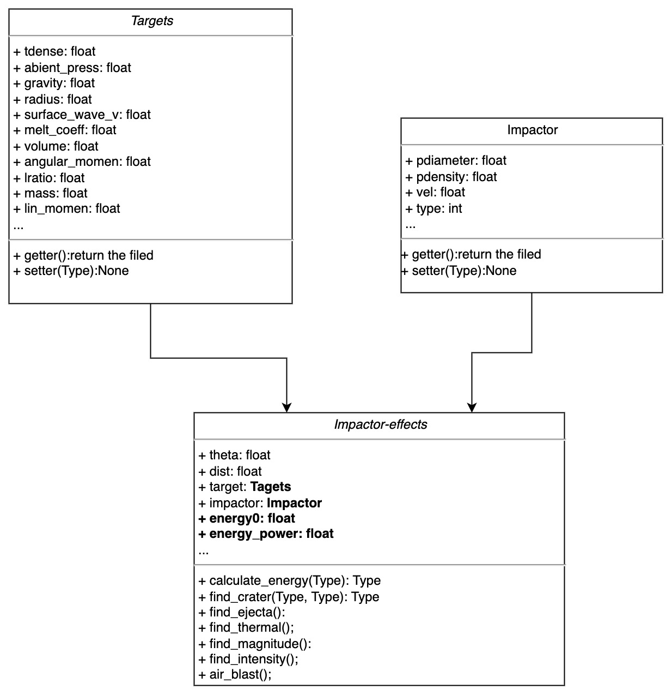

# Proposal for Impact Effects

## Introduction

Impact Effect aim to create the python package, which provide the essiential functions for simulating the consequences of a comet or asteriod impact on earth or other planets.

For achieving this, we first review the structure of the original Web-based program. Then we introduce the design of interface and function of python library.

## Background: Structure of original program

The program get the data from User input, and check the validity of data. Then function **impact_effects** calculate all the status and results, containing plenty of sub-functions.

**The main logic of impact_effects is:**

As the image shows, yellow parts are the crucial functions , using the formulas in the paper to calculate many important results. 

## Package design

Based on the objected-oriented idea, we sperate the original programing into three classes, which are:

- Target: It's used to describe the planet being hit and the features of its surface, like Earth.

- Impactor: Impactor is used to describe the characteristics of comets or meteorites.

- Impactor-effects: take the instances of class Target and Impactor as paramaters, providing the essential functions, included in the original program.

Under this design, we do have several promotions.

### Low coupling design && Easy to expand

We split the program into three entities, target and impactor and impact-effect. This approach allows us to expand very easily. For example, creating a impactor instance with different parameters would simulate a different comet or asteroid impact, or creating a Tagert instance to describe Mars.

### Easy to use

Users only need to create Target and Impact instances first, and then use these two instances to build impact-Effects instances. The Impact-Effects example provides a number of practical useful approaches.