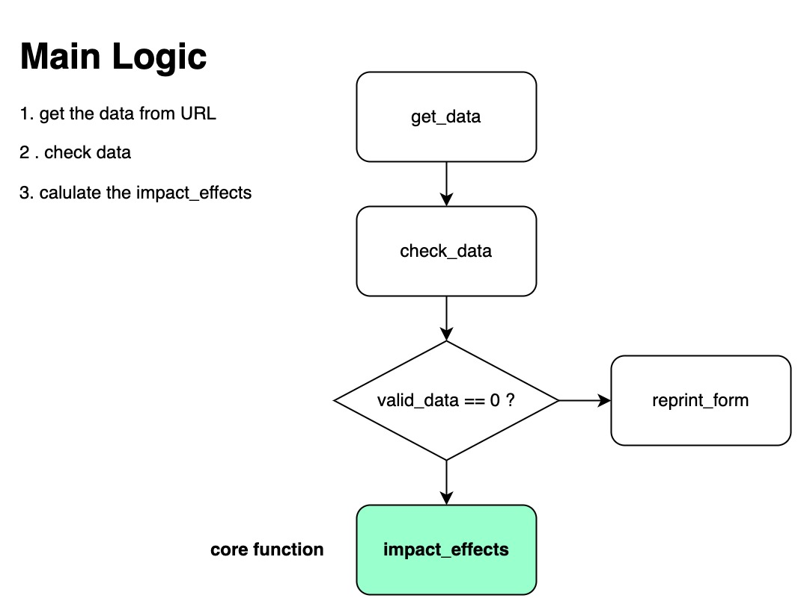
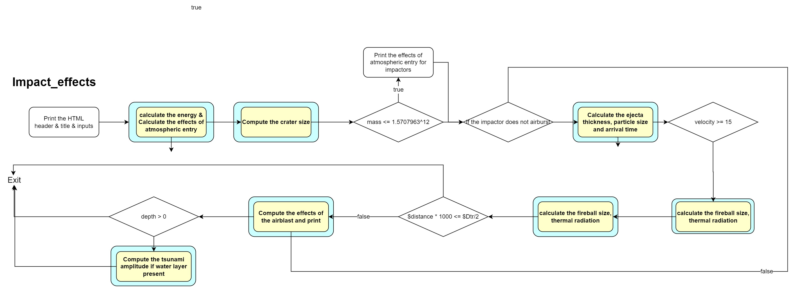

# Proposal for Impact Effects

## Introduction

我们的主要目标是基于原始代码和论文重新构建一个python库，它能够提供必要的函和可拓展性给用户来构建他们自己的应用程序，用来模拟和观察小行星和彗星撞击的全过程。用户既可以用它来进行实验性的教学，又可以用它产生的结果进行科研研究。一些可能的应用方向例如，利用它产生的结果构建一个风险预测工具，预测撞击事件可能的影响等等。我们会考虑一下必要的拓展，包括一个web程序来可视化撞击事件的结果，利用我们构建的python库为核心。另外，我们计划支持小行星和彗星群对目标行星的撞击模拟，因为这种情况相当普遍。

## Background: Structure of original program

首先，我们分析一下原来的web程序的主要逻辑。在梳理之后，我们可以从中抽取出关键函数，作为后续实现python library的基础。

Web程序从用户输入中获取数据，并检查数据的有效性。然后impact-effect函数影响效果计算所有的状态和结果，其中包含大量的子函数。impact-effect的详细逻辑如下: 

**The main logic of impact_effects is:**

如图所示，黄色部分是关键函数，利用文中的公式计算了许多重要的结果。而如果方框被蓝色包裹，代表会打印相关结果。

impact_effects整体逻辑比较简单，逐步计算相关的物理参数。如果撞击过程满足部分条件，则会触发额外的一些计算过程。

首先，程序计算能量..根据程序注释。

### Drawbacks

事实上，原始的代码工作地很好，模拟器能够迅速的给出模拟结果，并展示在网页上。但是，对于我们的目标而言，它仍旧存在一些问题。首先，他是基于脚本语言perl。perl语言非常优秀，但是我们希望构建的是一个能够广泛被使用的工具。根据TIOBE最新的数据（2022年五月），perl语言的使用占比小于百分之一，排名在第十七位。而python的使用占比在12.74%，排名第一。这意味着，如果我们使用python重新构建一个library，更多的用户可以省去学习语言的成本。受众将会更广。第二点，代码结构可以满足构建web应用的需求，但是它是强耦合的。强耦合意味着程序中主要函数和变量绑定在一起，这会对后续拓展造成极大的麻烦。一个变量的改动可能牵扯到多个函数的变动。然而更加糟糕的是，没有显示的变量和函数之间的引用关系。这非常不利于代码的阅读。第三点，原始的代码不支持模块化，也不支持版本控制和持续集成等现代编程方法。这意味着代码的质量难以通过持续集成来保证，也无法受益于现代自动化部署和测试工具。不支持版本控制使得代码拓展过程中很难进行团体合作，也很难进行代码回退。

## Python Library design

### Objective

正如上述一些问题存在，我们考虑使用python以及现代编程技巧，在保留原始代码的主要功能的情况下，构建出一个可用性强和拓展性强到Library。
- 首先希望利用面向对象编程的思想来组织我们的函数和数据。面向对象范式的优点在于讲函数和数据进行绑定，以实体的形式来模拟现实世界，例如对于撞击器来说，我们将其抽象为一个类。撞击器类包含有描述它本身性质的参数，以及一些必要的函数和方法。对于目标星球来说也是类似的逻辑。这样我们就可以将撞击过程抽象出来，它和撞击器以及被撞击星球解耦合了。
- 其次我们希望集成版本控制以及CI/CD，这样我们可以持续推进和演化我们的项目。CI/CD支持对我们的代码进行自动化校验和自动化部署，减少重大BUG出现的概率。
- 最后，我们希望新的Library是易于拓展和易于使用的，这很大程度上取决于我们的代码设计。

### Design Details

基于面向对象的想法，我们将原分为三个类，即：

- 目标：它用于描述被击中的行星及其表面的特征，例如地球。

- 影响器：影响器用于描述彗星或陨石的特征。

- 影响器效应：以班级目标和影响器的实例为参数，提供原始程序中包含的基本功能。

在此设计下，我们确实有几个促销活动。

### Low coupling design && Easy to expand。

我们将程序分为三个实体，目标和影响者以及影响-效果。这种方法允许我们非常容易地扩展。例如，创建一个具有不同参数的撞击器实例可以模拟不同的彗星或小行星撞击，或者创建一个Tagert实例来描述火星。

### Easy to use

用户只需要首先创建Target和Impact实例，然后使用这两个实例构建Impact - effects实例。Impact-Effects示例提供了许多实用的有用方法。